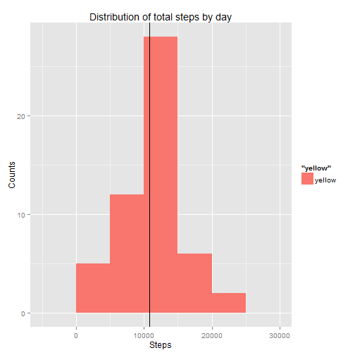
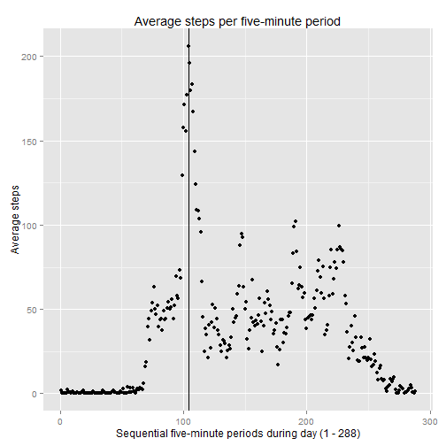
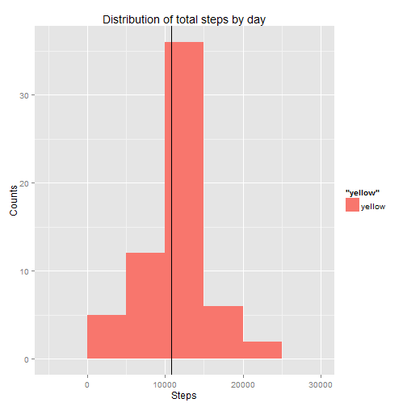
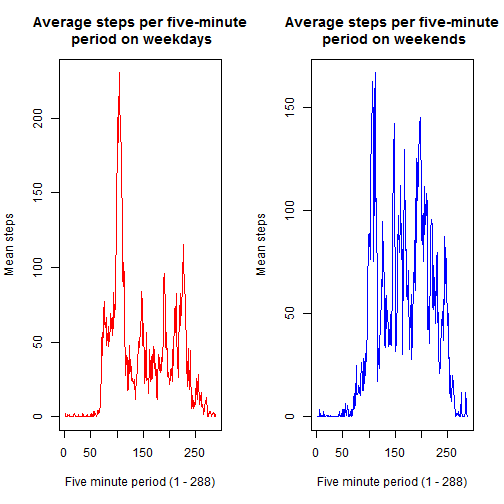

##The following document is meant to satisfy the requirements of Project 1 of the Johns Hopkins/Coursera Reproducible Research Course.

###Loading and preprocessing the data

Show any code that is needed to

1) Load the data (i.e. read.csv())

2) Process/transform the data (if necessary) into a format suitable for your analysis


```r
##Get file and read into a data.frame
today <- Sys.time()
#Url <- "https://d396qusza40orc.cloudfront.net/repdata%2Fdata%2Factivity.zip"
#download.file(Url, "Factivity.zip")
#unzip("Factivity.zip", overwrite = TRUE)
fact <- read.csv("activity.csv")
#Append a column which corresponds to relative five-minute-period (1 - 288).
fact <- cbind(fact, 1:288)
names(fact)[4] <- "period"

cat("Data is downloaded at ", today, " and after being ammended, has ", dim(fact)[1], " observations by  ", dim(fact)[2], "variables and has names: ", names(fact), "  The period variable was added to convert the 5-minute intervals to a perfect sequence vs. the way it is listed where each interval is prefixed with a number corresponding to the hour, resulting in a sequence with varying intervals.\n")
```

```
## Data is downloaded at  1415804477  and after being ammended, has  17568  observations by   4 variables and has names:  steps date interval period   The period variable was added to convert the 5-minute intervals to a perfect sequence vs. the way it is listed where each interval is prefixed with a number corresponding to the hour, resulting in a sequence with varying intervals.
```

###What is mean total number of steps taken per day?

For this part of the assignment, you can ignore the missing values in the dataset.

1) Make a histogram of the total number of steps taken each day

2) Calculate and report the mean and median total number of steps taken per day


```r
#Omit observations with NA's
fact_nona <- subset(fact, steps != "NA")
#Sum steps by day
tot_day <- with(fact_nona, aggregate(steps, list(date), sum))
names(tot_day) <- c("date", "total_day")
#Average of total steps by day
avg_day <- mean(tot_day$total_day)  
#Median of total steps by day
med_day <- median(tot_day$total_day)

#Histogram which also reports mean via a vertical line
library(ggplot2)
p <- qplot(tot_day$total_day, binwidth = 5000,
           main = "Distribution of total steps by day",
           xlab = "Steps",
           ylab = "Counts",
           fill = "yellow")
mn <- geom_vline(aes(xintercept=avg_day))
p + mn
```

 

```r
cat("The mean of the total number of steps taken per day is", avg_day, ", and the median of the total number of steps taken per day is", med_day, ".  The difference between the two is only", abs(avg_day - med_day), ".\n")
```

```
## The mean of the total number of steps taken per day is 10766.19 , and the median of the total number of steps taken per day is 10765 .  The difference between the two is only 1.188679 .
```

###What is the average daily activity pattern?

1) Make a time series plot (i.e. type = "l") of the 5-minute interval (x-axis) and the average number of steps taken, averaged across all days (y-axis)

2) Which 5-minute interval, on average across all the days in the dataset, contains the maximum number of steps?


```r
#Get means of steps by five-minute period
avg_period <- with(fact_nona, aggregate(steps, list(period), mean))
names(avg_period) <- c("period", "avg_period")
mx_period <- order(avg_period$avg_period, decreasing = TRUE)[1]
#Plot average steps by five-minute period
pp <- qplot(avg_period$period, avg_period$avg_period,
           main = "Average steps per five-minute period",
           xlab = "Sequential five-minute periods during day (1 - 288)",
           ylab = "Average steps")
mx <- geom_vline(aes(xintercept=mx_period))
pp + mx
```

 

```r
cat("The five-minute interval during the day where subject takes the maximum amount of steps on average is the ", mx_period, "th, or during the interval spanning the ", 5*(mx_period - 1), "th and the ", 5*mx_period, "th minutes within the ", 24*60, " minutes of the day.  In clock time, that is the five minute period beginning", floor(5*(mx_period - 1)/60), ":", (5*(mx_period - 1)) %% 60, " in the morning.\n")
```

```
## The five-minute interval during the day where subject takes the maximum amount of steps on average is the  104 th, or during the interval spanning the  515 th and the  520 th minutes within the  1440  minutes of the day.  In clock time, that is the five minute period beginning 8 : 35  in the morning.
```

###<p>Imputing missing values

Note that there are a number of days/intervals where there are missing values (coded as NA). The presence of missing days may introduce bias into some calculations or summaries of the data.

1) Calculate and report the total number of missing values in the dataset (i.e. the total number of rows with NAs)

2) Devise a strategy for filling in all of the missing values in the dataset. The strategy does not need to be sophisticated. For example, you could use the mean/median for that day, or the mean for that 5-minute interval, etc.

3) Create a new dataset that is equal to the original dataset but with the missing data filled in.

4) Make a histogram of the total number of steps taken each day and Calculate and report the mean and median total number of steps taken per day. Do these values differ from the estimates from the first part of the assignment? What is the impact of imputing missing data on the estimates of the total daily number of steps?</p>

```r
#1)
complete <- complete.cases(fact)
table(complete)[1]
```

```
## FALSE 
##  2304
```

```r
#2)
x <- c()
for(i in 1:4){x[i] <- sum(is.na(fact[,i]))}; x
```

```
## [1] 2304    0    0    0
```

```r
#Above code reveals that there are only NA's in the first (steps) column.  So, we will simply replace each NA in steps with the average of steps for that period.

#3)
#Get average steps per period
avg_steps_period <- with(na.omit(fact), aggregate(steps, by = list(period), mean))
names(avg_steps_period) <- c("period", "avgStepsPeriod")
#Add column of average steps per period and keep in original order (by date and period)
fact <- merge(fact, avg_steps_period, by = "period")
index <- with(fact, order(date, period))
fact <- fact[index,]
#Add column of imputed steps (actual steps if known or avg steps/period) for max disclosure
fact$imputedSteps <- fact$steps
fact_nona <- fact[!is.na(fact$steps),]
fact_isna <- fact[is.na(fact$steps),]
fact_isna$imputedSteps <- fact_isna$avgStepsPeriod
fact <- rbind(fact_nona, fact_isna)

#Just what was requested please
imputedFact <- fact[with(fact, order(date, interval)), c(6,3,4,1)]
str(imputedFact)
```

```
## 'data.frame':	17568 obs. of  4 variables:
##  $ imputedSteps: num  1.717 0.3396 0.1321 0.1509 0.0755 ...
##  $ date        : Factor w/ 61 levels "2012-10-01","2012-10-02",..: 1 1 1 1 1 1 1 1 1 1 ...
##  $ interval    : int  0 5 10 15 20 25 30 35 40 45 ...
##  $ period      : int  1 2 3 4 5 6 7 8 9 10 ...
```

```r
#4)
tot_day2 <- with(imputedFact, aggregate(imputedSteps, list(date), sum))
names(tot_day2) <- c("date", "total_day")
#Average of total steps by day
avg_day2 <- mean(tot_day2$total_day)  
#Median of total steps by day
med_day2 <- median(tot_day2$total_day)

#Histogram which also reports mean via a vertical line
library(ggplot2)
p2 <- qplot(tot_day2$total_day, binwidth = 5000,
           main = "Distribution of total steps by day",
           xlab = "Steps",
           ylab = "Counts",
           fill = "yellow")
mn2 <- geom_vline(aes(xintercept=avg_day2))
p2 + mn2
```

 

```r
#Difference in means between imputed data and non-imputed data:
paste("unimputed average is", avg_day, ".")
```

```
## [1] "unimputed average is 10766.1886792453 ."
```

```r
paste("Imputed average is", avg_day2, ".")
```

```
## [1] "Imputed average is 10766.1886792453 ."
```

```r
paste("Absolute difference is", abs(avg_day2 - avg_day), ".")
```

```
## [1] "Absolute difference is 0 ."
```

```r
paste("unimputed median is", med_day, ".")
```

```
## [1] "unimputed median is 10765 ."
```

```r
paste("Imputed median is", med_day2, ".")
```

```
## [1] "Imputed median is 10766.1886792453 ."
```

```r
paste("Absolute difference is", abs(med_day2 - med_day), ".")
```

```
## [1] "Absolute difference is 1.1886792452824 ."
```

```r
paste("By imputing the NA's with mean steps by period, the center of the imputed data is more centered, causing the median of the imputed data to be right at the mean.")
```

```
## [1] "By imputing the NA's with mean steps by period, the center of the imputed data is more centered, causing the median of the imputed data to be right at the mean."
```

###<p>Are there differences in activity patterns between weekdays and weekends?

For this part the weekdays() function may be of some help here. Use the dataset with the filled-in missing values for this part.

1) Create a new factor variable in the dataset with two levels - "weekday" and "weekend" indicating whether a given date is a weekday or weekend day.

2) Make a panel plot containing a time series plot (i.e. type = "l") of the 5-minute interval (x-axis) and the average number of steps taken, averaged across all weekday days or weekend days (y-axis). See the README file in the GitHub repository to see an example of what this plot should look like using simulated data.</p>

```r
#1)
weekend <- ifelse(weekdays(as.Date(fact$date)) %in% c("Saturday", "Sunday"),
       "weekend",
       "weekday")
fact$weekend <- factor(weekend)
fact <- fact[with(fact, order(date, period)),
             c("imputedSteps", "date", "interval", "period", "weekend",
               "steps", "avgStepsPeriod")]

#2)
wknd <- fact[fact$weekend == "weekend", ]
wkdy <- fact[fact$weekend == "weekday", ]
avg_per_wknd <- with(wknd, aggregate(imputedSteps, by = list(period, weekend), mean))
avg_per_wkdy <- with(wkdy, aggregate(imputedSteps, by = list(period, weekend), mean))
par(mfrow = c(1,2))
plot(x = avg_per_wkdy[,1], y = avg_per_wkdy[,3],
     type = "l",
     main = "Average steps per five-minute\n period on weekdays",
     xlab = "Five minute period (1 - 288)",
     ylab = "Mean steps",
     col = "red")
plot(x = avg_per_wknd[,1], y = avg_per_wknd[,3],
     type = "l",
     main = "Average steps per five-minute\n period on weekends",
     xlab = "Five minute period (1 - 288)",
     ylab = "Mean steps",
     col = "blue")
```

 
